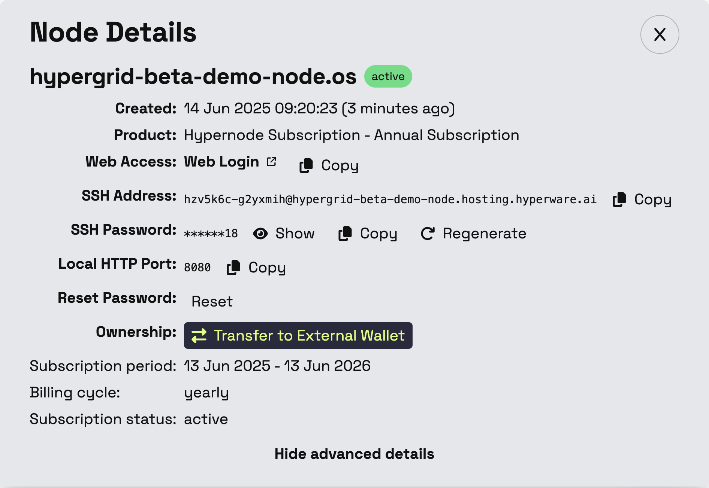
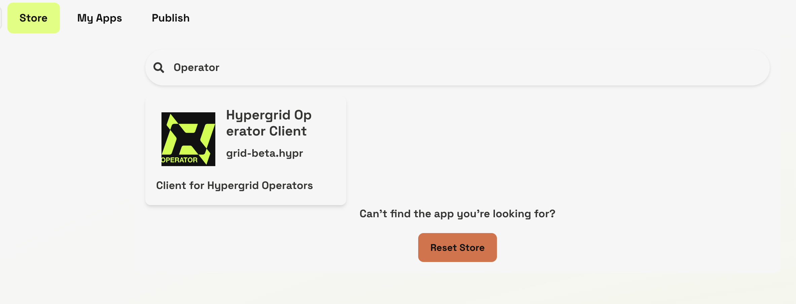
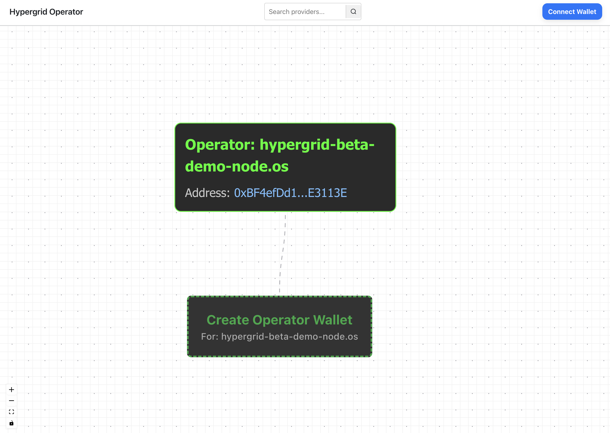
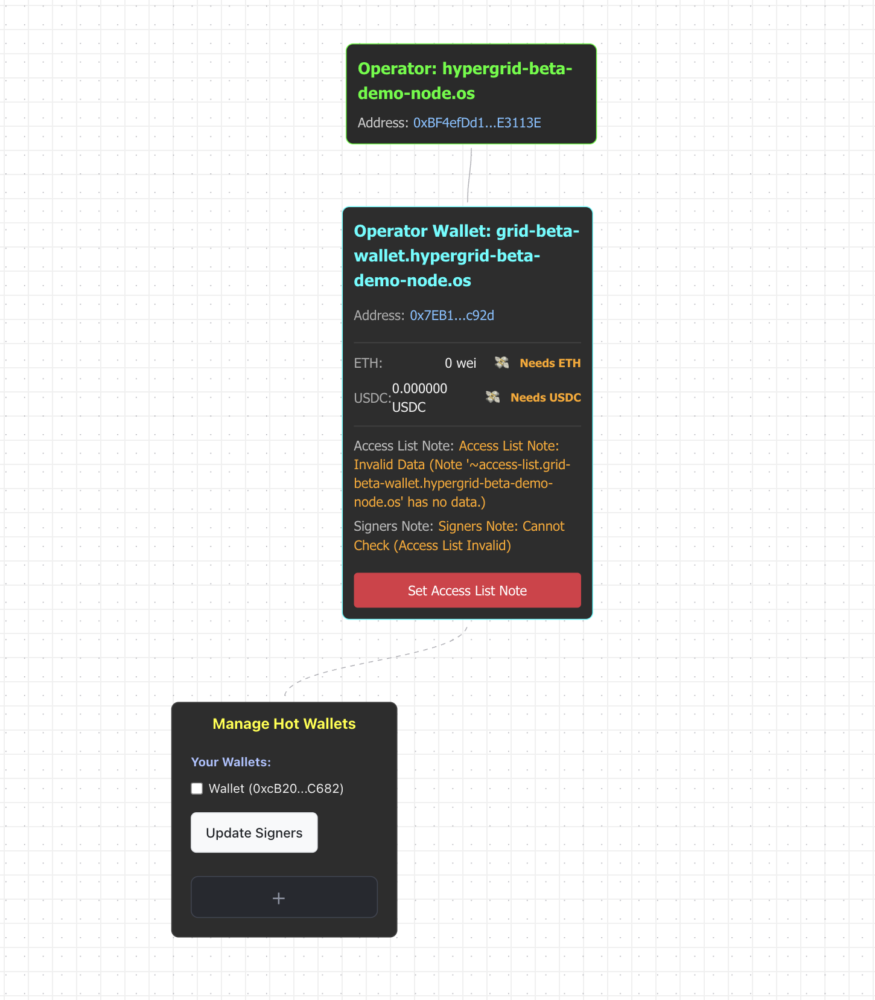
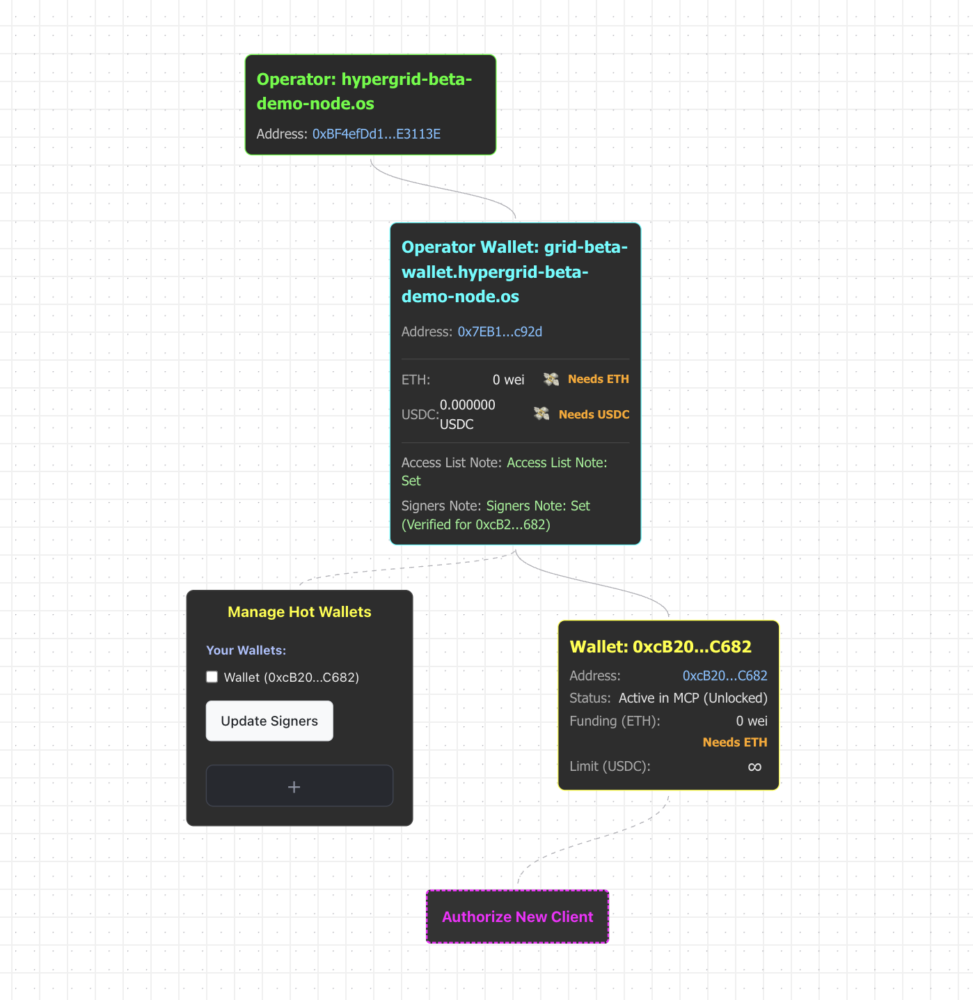
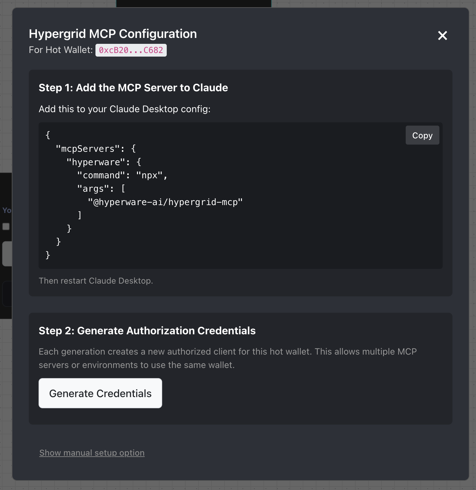

# Running an Operator Node

The Hypergrid protocol allows for *Operators* to make micropayments in USDC on the Base blockchain in exchange for services from *Providers*.
These providers are intended to solve the problem of "out-of-distribution data retrieval" for LLMs: rather than do a lossy and adversarial web search for up-to-date data, just identify a Provider and get that data instantly in a neat JSON format.
Prices, weather, news, and more can all be neatly worked into this format. 

The Hypergrid Operator Client exposes two tools to LLMs: the first allows your agent to *search* the onchain registry of providers, and if it elects to use one to solve whatever problem it has, it can *call* that Provider with whatever query parameters are relevant to its task.
The protocol is still in beta and focused on simple request/response "data-feeds", but will soon accomodate all kinds of remote tool/function calls.

**Operator Setup**

**1. Get a Hyperware node**

The Hypergrid Provider clent is built on top of Hyperware, a p2p application deployment platform, so in order to act as a provider you'll need to be runnning a Hyperware node.
The simplest way to obtain a running node is through our hosting solution, Valet, where we will run your node for you.

Go to [valet.hyperware.ai](https://valet.hyperware.ai) and sign in to make your Valet account.
Once you've done that, you'll need an invite code in order to actually boot a node.
If you don't have one yet, join our [Discord](https://discord.com/invite/KwNE58RKpg) and ask in the `hypergrid-discussion` channel, we'll get you sorted out.
Then you can pick a node identity (think of it like a username, it doesn't matter too much) and boot your node.
Write down your password, since Hyperware is a very secure system and you'll need it later.

[You can also self-host your node](../getting_started/install.md), although we only recommend this for advanced users.

IMPORTANT: In order to properly configure a Hyperware Operator client, you will need to be able to mint entries in your namespace on the Base blockchain.
This means you will need to hold the NFT representing your node in a wallet that you can sign transactions from such as Metamask.
In the advanced settings tab for your node in Valet (hit the gear button), you will see the option to transfer ownership of your node from the Valet wallet to yours.
Be sure to copy your wallet very carefully, if you transfer it to the wrong address we cannot help you get it back.
Be sure you're on the Base network.

**2. Install Operator Client**

Once your node is booted, you'll be able to access the home screen, and from there you can navigate to the App Store.
This is an onchain registry of Hyperware applications similar to Hypergrid.
In that interface, you'll be able to search for the Operator client:

Check to make sure that you're getting the latest version and that the distributor is `grid-beta.hypr` or an approved mirror, then download and install the client.
You can then launch the app.

**3. Configure and fund your Operator**

In order to interface with Providers through the Hypergrid protocol, you'll need to configure your Operator client to be able to make payments in USDC on Base and authorize your MCP client.

When you first open the app, you'll see the configuration interface with the option to create an operator wallet underneath your node.
In this tutorial we'll be setting up `hypergrid-beta-demo-node.os`, and so the wallet will be `grid-beta-wallet.hypergrid-beta-demo-node.os`.
This is because the wallet is itself another entry in the Hypermap hierarchical namespace.
Click on "Create Operator Wallet" and you'll be prompted to sign a transaction to mint that entry.
Make sure that you've connected the Base wallet that owns the NFT representing your node.

Once you've done that, you'll see that you've now minted an NFT representing your Hypergrid wallet.
This is the wallet you will use to pay Providers for access to their data-feeds and services. 

Because you don't want your AI agents to have to wait for you to sign a transaction every time they want to call a Provider, you're able to set a "hot wallet" that is stored on your node that allows it to initiate USDC sends from the Operator Wallet.
This hot wallet does not custody any significant funds, and its permissions can be revoked at any time.

In order to set this up, you'll need to "Set Access List Note" (which will prompt you to sign a transaction), then select a hot wallet and press "Update Signers" (which will prompt you to sign another transaction).
Be sure that you've clicked the checkbox next to a hot wallet in the "manage hot wallets" tile.

You'll see that you have a new tile representing the hot wallet.
You can click the infinity symbol to adjust your spending limit (we recommend setting this to a very small amount, Provider payments should be small in most cases), and you'll see that the hot wallet is prompting with an "Authorize New Client" button.

The Hypergrid protocol is agnostic to the tool-use format you use to present it to an LLM, but for now we only support access via an MCP (Model Context Protocol) interface.
This tutorial uses the Claude Desktop interface, but the setup flow should be nearly identical for most MCP clients.

When you attempt to authorize a new client, you'll see this screen:

In Claude Desktop, you can open your settings, go to the "Developer" tab, and push the "edit config" button and paste in the provided text.
When you restart Claude Desktop, this will install the Hypergrid MCP shim, and you'll be able to continue.
The flow will be very similar for most LLM clients.

The "generate credentials" button will create a command that you can paste directly into your MCP client.
It prompts it to use a tool that sets the credentials.
From there you're almost ready to go!

The last step is to fund the wallets.
For now, while Hypergrid is in beta, you need to provide a small amount of ETH to both the hot wallet and the Operator Wallet.
This is purely to cover gas fees, and since gas is so cheap on Base after the Pectra upgrades, this can be a very very small amount.
We recommend no more than 5 cents worth to start.

You'll also need to fund the Operator Wallet with USDC.
This is used to pay providers on Hypergrid.
We also do not recommend putting a significant amount of USDC into the wallet, although your costs will depend on what kinds of Providers your agents are calling (some of them will be pricier than others) and how often they're using Hypergrid.

Once you've funded the wallets, you can direct any agent with access to an authorized MCP client to use Hypergrid providers for out-of-distribution data and services.

If you run into trouble or think that a provider is missing, come talk to us in the [Hyperware Discord server](https://discord.com/invite/KwNE58RKpg) and we'll sort things out.
This is a beta, so bug reports are encouraged.

