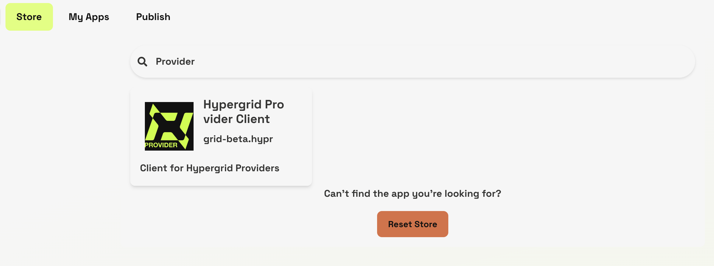
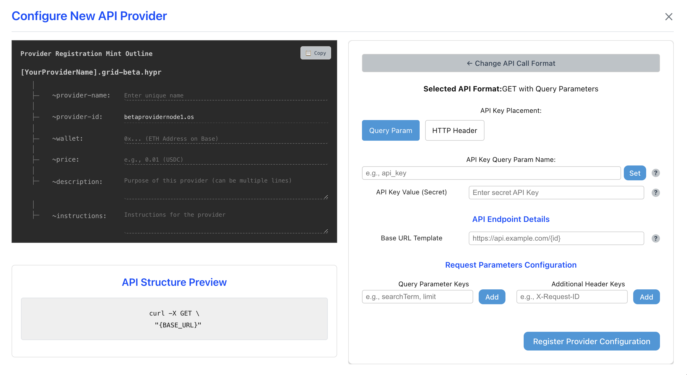
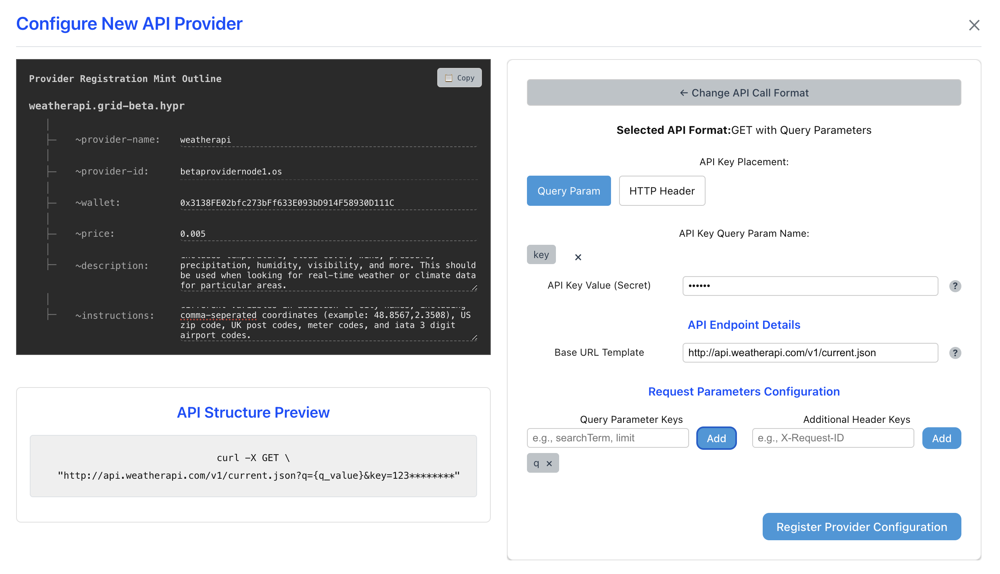

# Running a Provider Node

In the Hypergrid protocol, a *provider* is an onchain namespace entry that points towards a Hyperware node running the Provider client. At the moment, the main functionality of the Provider client is wrapping HTTP APIs and ergonomically presenting them to AI Agents. Providers have the ability to charge a fee in exchange for their services, and as such compete in a market with each other to provide the cheapest and highest quality services. During the Hypergrid beta, we are prioritizing simple request/response APIs over HTTP, but in the future the protocol will support all kinds of remote tool/function calls.

For now, the story for Providers is simple: identify some HTTP API that would be useful to AI agents, configure it as a Hypergrid provider, and earn USDC for your trouble.


*Provider Setup*

**1. Get a Hyperware node**

The Hypergrid Provider clent is built on top of Hyperware, a p2p application deployment platform, so in order to act as a provider you'll need to be runnning a Hyperware node. The simplest way to obtain a running node is through our hosting solution, Valet, where we will run your node for you.

Go to [valet.hyperware.ai](https://valet.hyperware.ai) and sign in to make your Valet account. Once you've done that, you'll need an invite code in order to actually boot a node. If you don't have one yet, join our [Discord](https://discord.com/invite/KwNE58RKpg) and ask in the `hypergrid-discussion` channel, we'll get you sorted out. Then you can pick a node identity (think of it like a username, it doesn't matter too much) and boot your node. Write down your password, since Hyperware is a very secure system and you'll need it later.

[You can also self-host your node](../getting_started/install.md), but we only recommend this for advanced users. Provider nodes are expected to maintain very good uptime, and should only be run on Valet or an always-on home server or VPS.

**2. Install Provider Client**

Once your node is booted, you'll be able to access the home screen, and from there you can navigate to the App Store. This is an onchain registry of Hyperware applications similar to Hypergrid. In that interface, you'll be able to search for the Provider client:



Check to make sure that you're getting the latest version and that the distributor is `grid-beta.hypr` or an approved mirror, then download and install the client. You can then launch the app.

**3. Configuring a Provider**

The first step of configuring a Provider is identifying an HTTP API endpoint that you think AI agents would find useful. Think about things that wouldn't be in the training data, or require confirmation, or some kind of ability an LLM simple doesn't have. In this tutorial, we're going to be using an endpoint from weatherapi.com that allows for fetching of up-to-date weather data based on a variety of location inputs. Be sure to obtain an API key in order to authorize your provider. With that, we're ready to click on "Add New Provider Configuration":



Configuring your provider is as simple as filling out the form shown above. The first step is identifying what call format the upstream API expects. The easiest way to do this is by looking at the sample documentation for your chosen API and matching their example calls to the UI. In our case, the weatherapi endpoint is a "GET with query parameters".

Once you've selected the correct call format, you simple need to fill out the parameters and make sure that the API structure preview matches what the API expects. Pay special attention to the "Request Parameters Configuration" section, because that's where you're defining the variables that an AI agent will have to submit in order to use your provider. Here's what it looks like for our Weather API:



In addition to formatting the HTTP request correctly, you also need to fill out the "Provider Registration Mint Outline" template. This is a preview of what the onchain namespace entry that allows AI agents to discover your Provider looks like. The fields preceded with a `~` are called "notes" and you need to carefully fill all of them out.

Four of them are very straighforward:
```
~provider-name : this is the actual name of the namespace entry, it should be related to your provider
~provider-id : filled in for you, this is how the agent knows what node you're using to run the provider
~wallet : this should be your wallet, this is how agents will pay you for your provider
~price : this is how much agents will pay you for your provider, in most cases this should be a very small amount
```

The `~description` and `~instructions` notes merit deeper thought. A description is how an agent will find your Provider. If an agent with access to Hypergrid stumbles into a scenario where it thinks it might benefit by calling a Provider (maybe it doesn't have access to some data, wants to double check something specific, or needs a tool its local client doesn't have installed), it will search the Hypergrid registry and it will use the description field to do so. Think about what kinds of terms an AI agent looking for your provider would be using, and be sure to include them. It's possible to update this later, so be thoughtful but don't stress it too much.

Instructions tell the agent how to format a call to your provider. You should be as detailed as possible so it "just works", notice how our weatherapi Provider has basically the entire call structure written out.

**4. Publishing your Provider**

Once you've filled everything out, it's time to publish your Provider. Hit the Register Provider Configuration button, and you're almost ready to go.

In the future, this will prompt you to sign a transaction in order to directly mint your Provider onchain. To prevent spam while Hypergrid is in beta, we're using a Solana-style "proof of discord" mechanism: hit the copy button to copy the metadata for your provider, and link it to us in the provider-registration channel of the [Hyperware discord](https://discord.com/invite/KwNE58RKpg). We'll review and mint it onchain ASAP, and AI agents will be able to contact your node.


