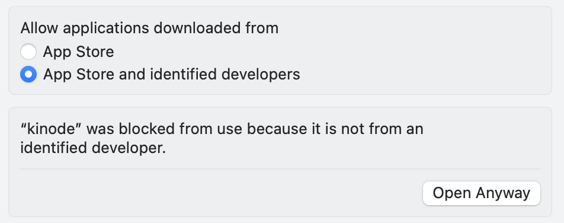

# Installation

This section will teach you how to get the Kinode core software, required to run a live node.
After acquiring the software, you can learn how to run it and [Join the Network](./login.md).

- If you are just interested in starting development as fast as possible, skip to [My First Kinode Application](./build-and-deploy-an-app.md).
- If you want to run a Kinode without managing it yourself, use the [Valet](https://valet.kinode.org) hosted service.
- If you want to make edits to the Kinode core software, see [Build From Source](#option-3-build-from-source).

## Option 1: Download Binary (Recommended)

Kinode core distributes pre-compiled binaries for MacOS and Linux Debian derivatives, like Ubuntu.

First, get the software itself by downloading a [precompiled release binary](https://github.com/kinode-dao/kinode/releases).
Choose the correct binary for your particular computer architecture and OS.
There is no need to download the `simulation-mode` binary — it is used behind the scenes by [`kit`](./kit/boot-fake-node.md).
Extract the `.zip` file: the binary is inside.

Note that some operating systems, particularly Apple, may flag the download as suspicious.

### Apple

First, attempt to run the binary, which Apple will block.
Then, go to `System Settings > Privacy and Security` and click to `Open Anyway` for the `kinode` binary:



## Option 2: Docker

Kinode can also be run using Docker.
MacOS and Debian derivatives of Linux, like Ubuntu, are supported.
Windows may work but is not officially supported.

### Installing Docker

First, install Docker.
Instructions will be different depending on your OS, but it is recommended to follow [the method outlined in the official Docker website.](https://docs.docker.com/get-docker/)

If you are using Linux, make sure to perform any post-install necessary afterwards.
[The official Docker website has optional post-install instructions.](https://docs.docker.com/engine/install/linux-postinstall/)

### Docker Image

The image expects a volume mounted at `/kinode-home`.
This volume may be empty or may contain another Kinode's data.
It will be used as the home directory of your Kinode.
Each volume is unique to each Kinode.
If you want to run multiple Kinodes, create multiple volumes.

The image includes EXPOSE directives for TCP port `8080` and TCP port `9000`.
Port `8080` is used for serving the Kinode web dashboard over HTTP, and it may be mapped to a different port on the host.
Port `9000` is optional and is only required for a direct node.

If you are running a direct node, you **must** map port `9000` to the same port on the host and on your router.
Otherwise, your Kinode will not be able to connect to the rest of the network as connection info is written to the chain, and this information is based on the view from inside the Docker container.

Run the following command to create a volume:

```bash
docker volume create kinode-volume
```

Then run the following command to create the container.
Replace `kinode-volume` with the name of your volume, and `my-kinode` with a unique name.
To map the port to a different port (for example, `80` or `6969`), change `8080:8080` to `PORT:8080`, where `PORT` is the post on the host machine.

```bash
docker run -d -p 127.0.0.1:8080:8080 -it --name my-kinode \
    --mount type=volume,source=kinode-volume,destination=/kinode-home \
    0xlynett/kinode
```

Check the status of your Docker processes with `docker ps`.
To start and stop the container, use `docker start my-kinode` or `docker stop my-kinode`.
To remove the container, run `docker remove my-kinode`.
(replace `my-kinode` with the name of your container)

As long as the volume is not deleted, your data remains intact upon removal or stop.
If you need further help with Docker, [access the official Docker documentation here](https://docs.docker.com/manuals/).

## Option 3: Build From Source

You can compile the binary from source using the following instructions.
This is only recommended if:

1. The [pre-compiled binaries](#download-binary) don't work on your system and you can't use [Docker](#docker) for some reason, or
2. You need to make changes to the Kinode core source.

### Acquire Dependencies

If your system doesn't already have `cmake` and OpenSSL, download them:

#### Linux

```bash
sudo apt-get install cmake libssl-dev
```

#### Mac

```bash
brew install cmake openssl
```

### Acquire Rust and various tools

Install Rust and some `cargo` tools, by running the following in your terminal:

```bash
curl --proto '=https' --tlsv1.2 -sSf https://sh.rustup.rs | sh
cargo install wasm-tools
rustup install nightly
rustup target add wasm32-wasi
rustup target add wasm32-wasi --toolchain nightly
cargo install cargo-wasi
```

For more information, or debugging, see the [Rust lang install page](https://www.rust-lang.org/tools/install).

Kinode uses the **nightly** build of Rust.
You will want to run the command `rustup update` on a regular basis to keep your version of the language current, especially if you run into issues compiling the runtime down the line.

### Acquire Kinode core

Clone and set up the repository:

```bash
git clone https://github.com/kinode-dao/kinode.git
```

Build the binary:

```bash
# OPTIONAL: --release flag
cargo +nightly build -p kinode
```

The resulting binary will be at path `kinode/target/debug/kinode`. (Note that this is the binary crate inside the `kinode` workspace.)

You can also build the binary with the `--release` flag.
Building without `--release` will produce the binary significantly faster, as it does not perform any optimizations during compilation, but the node will run much more slowly after compiling.
The release binary will be at path `kinode/target/release/kinode`.
