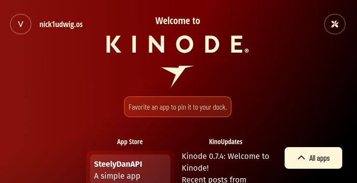

# Join the Network

Let's get onto the live network!

These directions are particular to the Kinode OS beta release.

Kinode is in active development on Optimism.

## Starting the Kinode

Start a Kinode using the binary acquired in the [previous section](./install.md).
Locating the binary on your system, print out the arguments expected by the binary:

```
$ # NOTE: if you built source yourself, the binary will be in the repository
$ #   at ./kinode/target/debug/kinode (or ./kinode/target/release/kinode).
$ ./kinode --help
A General Purpose Sovereign Cloud Computing Platform

Usage: kinode [OPTIONS] <home>

Arguments:
  <home>  Path to home directory

Options:
      --port <PORT>            Port to bind [default: first unbound at or above 8080]
      --ws-port <PORT>         Kinode internal WebSockets protocol port [default: first unbound at or above 9000]
      --verbosity <VERBOSITY>  Verbosity level: higher is more verbose [default: 0]
      --reveal-ip              If set to false, as an indirect node, always use routers to connect to other nodes.
      --rpc <RPC>              Add a WebSockets RPC URL at boot
  -h, --help                   Print help
  -V, --version                Print version
```

A home directory must be supplied — where the node will store its files.
The `--rpc` flag is an optional `wss://` WebSocket link to an Ethereum RPC, allowing the Kinode to send and receive Ethereum transactions — used in the [identity system](./identity_system.md) as mentioned [above](#creating-an-alchemy-account).
If this is not supplied, the node will use a set of default RPC providers served by other nodes on the network.
If the `--port` flag is supplied, Kinode will attempt to bind that port for serving HTTP and will exit if that port is already taken.
If no `--port` flag is supplied, Kinode will bind to `8080` if it is available, or the first port above `8080` if not.

### Acquiring an RPC API Key [OPTIONAL]

Create a new "app" on [Alchemy](https://dashboard.alchemy.com/apps) for Optimism Mainnet.


Copy the WebSocket API key from the API Key button:


#### Alternative to Alchemy

As an alternative to using Alchemy's RPC API key, [Infura's](https://app.infura.io) endpoints may be used. Upon creating an Infura account, the first key is already created and titled 'My First Key'. Click on the title to edit the key.


Next, check the box next to Optimism "MAINNET". After one is chosen, click "SAVE CHANGES". Then, at the top, click "Active Endpoints".


On the "Active Endpoints" tab, there are tabs for "HTTPS" and "WebSockets". Select the WebSockets tab. Copy this endpoint and use it in place of the Alchemy endpoint in the following step, "Running the Binary".


### Running the Binary

In a terminal window, run:
```bash
./kinode home
```

A new browser tab should open, but if not, look in the terminal for this line:
```
login or register at http://localhost:8080
```

and open that `localhost` address in a web browser.

## Registering an Identity

Next, register an identity.
If the page looks like:


then proceed to [Acquiring a Wallet](#aside-acquiring-a-wallet).
Otherwise, if the page looks like:


the browser already has a supported wallet installed.
Click `Register Kinode Name` and proceed to [Connecting the Wallet](#connecting-the-wallet).

### Aside: Acquiring a Wallet

To register an identity, Kinode must send an Ethereum transaction, which requires ETH and a cryptocurrency wallet.
While many wallets will work, the examples below use Metamask.
Install Metamask [here](https://metamask.io/download/).

### Connecting the Wallet

After clicking 'Register Kinode Name', click `Connect Wallet` and follow the wallet prompts:


### Aside: Bridging ETH to Optimism

Bridge ETH to Optimism using the [official bridge](https://app.optimism.io/bridge).
Many exchanges also allow sending ETH directly to Optimism wallets.

### Setting Up Networking (Direct vs. Routed Nodes)

When registering on Kinode, you may choose between running a direct or indirect (routed) node.
Most users should use an indirect node.
To do this, simply leave the box below name registration unchecked.


An indirect node connects to the network through a router, which is a direct node that serves as an intermediary, passing packets from sender to receiver.
Routers make connecting to the network convenient, and so are the default.
If you are connecting from a laptop that isn't always on, or that changes WiFi networks, use an indirect node.

A direct node connects directly, without intermediary, to other nodes (though they may, themselves, be using a router).
Direct nodes may have better performance, since they remove middlemen from connections.
Direct nodes also reduces the number of third parties that know about the connection between your node and your peer's node (if both you and your peer use direct nodes, there will be no third party involved).

Use an indirect node unless you are familiar with running servers.
A direct node must be served from a static IP and port, since these are registered on the Ethereum network and are how other nodes will attempt to contact you.

Regardless, all packets, passed directly or via a router, are end-to-end encrypted.
Only you and the recipient can read messages.

As a direct node, your IP is published on the blockchain.
As an indirect node, only your router knows your IP.

### Sending the Registration Transaction

After clicking `Register .os name`, click through the wallet prompts to send the transaction:


### What Does the Password Do?

The password encrypts the node's networking key.
The networking key is how your node communicates securely with other nodes, and how other nodes can be certain that you are who you say you are.


## Welcome to the Network

After setting the node password, you will be greeted with the homepage.


